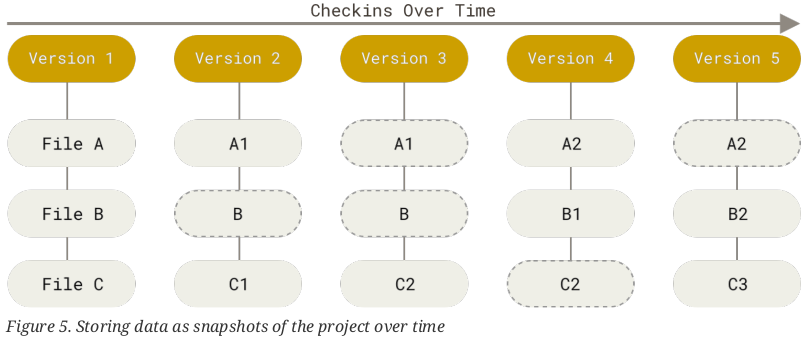

# Introducción Git

Este tutorial tiene la intención de recopilar y explicar desde los comandos que más usaría yo y de qué manera. A lo largo de las actualizaciones se han ido añadiendo comandos a Git, de tal forma que se puede hacer la misma acción (o simillar) con distintos comandos.

Gracias a que Git es tan flexible, se puede trabajar con él de distintas maneras según las condiciones. Esto significa que lo que va bien para un proyecto, no tiene que ser lo correcto para otro.

Se usarán varias imágenes pertenecientes al libro [ProGit](https://git-scm.com/book/en/v2) para explicar cómo funciona Git y también imágenes propias. Además se mantendrán en inglés los términos utilizados, ya que es el idioma en el que veremos siempre este contenido.

En esta explicación me centraré en "un proyecto pequeño" llevado por una o dos personas, que es de la manera en que yo uso Git.

<br>

## Recomendación

Ante la duda o información incorrecta aquí expuesta, lo recomendable es leer el libro [ProGit](https://git-scm.com/book/en/v2) en sus capítulos:
+   1. Getting Started
+   2. Git Basics
+   6. GitHub

Son los que contienen la información más relevante para el día a día de usar Git.

<br>

## Funcionamiento Git

Git es un sistema de control de versiones, esto significa que cada vez que hacemos algo en nuestro proyecto y lo guardamos a través de Git, podemos acceder a qué se ha cambiado respecto a la anterior o anteriores veces.

Para conseguir esto, cada vez que se guarda las modificaciones de un archivo, se coge ese archivo y se guarda entero en un sitio especial, además de asignarle una referencia. Entonces, mediante las referencias podemos ver las diferencias que han habido, ya que están guardados los archivos (solo los que han sufrido modificaciones) enteros de cada versión.

No se guardan las diferencias entre un archivo y su siguiente modificación. Se guarda el archivo entero cada vez que es modificado.



Para conseguir todo esto, se debe tener una carpeta como un repositorio de Git en local. Se verá más adelante.

<br>

## Áreas del repositorio

El repositorio se divide en tres áreas con las que trabaja Git.

+   Working directory
    +   Es el directorio de trabajo actual, donde se modifican los archivos. Cuando se cambia de un branch a otro o de la visualización de un commit a otro, el working directory cambia, pudiendo perder los datos modificados que no se les haya hecho commit. 
+   Stagging area
    +   Es la zona donde se guarda temporalmente los archivos marcados para el próximo commit. Aún no hay nada guardado y se puede perder.
+   .git directory
    +   Es la zona que corresponde a la base de datos del repositorio, donde están guardados todos los branch, commit, referencias e historial del proyecto. Cada vez que se hace un commit, los archivos pasan aquí y ya no se perderán, están seguros.

Ante la posible pérdida de datos, Git nos avisará de ello antes de proceder.


<br>

## Estado de un archivo

Los archivos em el proyecto pueden estar en tres estados posibles, estados en el que Git ve a los archivos.

+   Modified
    +   Se han hecho cambios en un archivo, difiere del último commit
+   Staged
    +   Se ha añadido el archivo para el próximo commit
+   Commited
    +   Se ha hecho el snapshot de el/los archivos de forma satisfactoria


Se puede no tener en cuenta un archivo si fuera necesario, como los compilados resultantes en un proyecto o ciertos archivos de configuración locales a través de un archivo `.gitignore`.

<br>

## Flujo de trabajo

La manera de trabajar a diario con Git es la siguiente.

1. Se trabaja en el `Working directory` modificando los archivos necesarios.
2. Se añaden al `Stagging area` de forma selectiva un archivo o varios en común para el próximo commit. ¿Por qué uno solo, o varios en común? Porque es mucho mejor para colocar el mensaje del commit y rastrear errores.
3. Se hace `Commit` de los archivos modificados en el stagging area para proceder a guardar la snapshot de los archivos en la base de datos.

<br><br>

# Primeros pasos

## Instalación

Linux, mediante la terminal.
>`sudo apt install git`

Windows, mediante instalador. Todo siguiente.
>[Descargar git](https://git-scm.com/downloads)

<br>

## Configuración inicial

Una vez instalado Git, es necesario realizar una configuración previa para establecer el usuario que firma los commit. A través de la terminal de linux o el Git shell de windows, se colocan los siguientes comandos.

`A partir de aquí, cualquier cosa es esté entre <>, se sustituye por información, quitando los triángulos. Si hay algún otro símbolo alrededor, como comillas, se dejan puestas.`

Usuario y correo:

>`git config --global user.name "<mi nombre>"`

>`git config --global user.email <miEmail@server.net>`

<br><br>

# Comandos

Debido a la gran cantidad de comandos y sus múltiples parámetros, pondré los que me han resultado más útiles y cómo usarlos.

El primer comando que debéis aprender es el de ayuda. Que mostrará los comandos disponibles y cómo utilizarlos. Hay varias maneras de acceder a la ayuda
>`git help`

>`git help <comando>`

>`git <comando> --help`

>`man git-<comando>` 
>>Ejemplo: `man git-add`

Si hacemos `git help` nos mostrará de forma clasificada de los comandos más utilizados.

```
start a working area (see also: git help tutorial)
   clone             Clone a repository into a new directory
   init              Create an empty Git repository or reinitialise an existing one

work on the current change (see also: git help everyday)
   add               Add file contents to the index
   mv                Move or rename a file, a directory, or a symlink
   restore           Restore working tree files
   rm                Remove files from the working tree and from the index
   sparse-checkout   Initialise and modify the sparse-checkout

examine the history and state (see also: git help revisions)
   bisect            Use binary search to find the commit that introduced a bug
   diff              Show changes between commits, commit and working tree, etc
   grep              Print lines matching a pattern
   log               Show commit logs
   show              Show various types of objects
   status            Show the working tree status

grow, mark and tweak your common history
   branch            List, create, or delete branches
   commit            Record changes to the repository
   merge             Join two or more development histories together
   rebase            Reapply commits on top of another base tip
   reset             Reset current HEAD to the specified state
   switch            Switch branches
   tag               Create, list, delete or verify a tag object signed with GPG

collaborate (see also: git help workflows)
   fetch             Download objects and refs from another repository
   pull              Fetch from and integrate with another repository or a local branch
   push              Update remote refs along with associated objects

```

Si colocamos `git help -a` nos mostrará todo el listados disponible de git.

<br>

## Inicializar un repositorio

Hay dos maneras de obtener un repositorio de Git.
+ Creando uno nuevo
+ Clonando uno existente de un sitio remoto

### Crear de cero

Si se crea un repositorio de cero, podemos hacerlo en una carpeta ya existente con nuestro código o en una carpeta nueva. Nos posicionamos dentro de esa carpeta mediante la terminal.
>`cd /home/proyectos/pong`

Se inicializa el repositorio.
>`git init`

Esto creará la carpeta `.git` que contendrá todo el historial de nuestro proyecto. Con esto ya podremos utilizar Git de forma local. Si se quiere llevar este nuevo repositorio local a GitHub, se deberá crear primero un repositorio (vacío a poder ser) con una cuenta de GitHub. Una vez creado podremos obtener el link del repositorio con el botón verde "Clone". Nos dará a elegir entre HTTPS o SSH, lo recomendable ya es SSH. Entonces enlazaremos el repositorio local con el de Github, el remoto.

>`git remote add <nombreRemoto> <HTTPS o SSH>`
>>Ejemplo: `git remote add origin https://github.com/Xibhu/Tutoriales`

Esto le indicará al repositorio local que tiene un repositorio remoto al que hemos llamado `origin` (como si se llama `paco`) que apunta a esa dirección HTTPS.

---

<br>

### Clonando uno existente

Si se clona un repositorio, nos posicionamos en la carpeta donde se quiere que se copie la carpeta del repositorio.
>`cd /home/proyectos`

Se clona dicho repositorio, por ejemplo con https, se verá en el botón verde "Clone" del repositorio en GitHub. Si se usa SSH se deberá elegir el link correspondiente y las instrucciones para poner a funcionar SSH.

>`git clone <HTTPS o SSH>`
>>Ejemplo: `git clone https://github.com/Xibhu/Tutoriales`

<br>

### Conexión segura SSH

Si se va a usar Github a través de terminal, se deberá establecer una conexión SSH. Seguir las instrucciones [aquí](https://docs.github.com/en/github/authenticating-to-github/connecting-to-github-with-ssh) indicadas.

Si en windows se usa `GitHub Desktop` no se vería afectado y no es neceario.

---

<br>

### Trabajar en local

Ahora es el momento de editar nuestros archivos. Mientras estamos editando, podremos ver el estado de nuestros archivos.

>`git status`

Cuando estén listos para ser guardados en la base de datos se hace lo siguiente.

>`git add <ruta o archivo>`
>>Ejemplo: `git add func.cpp`

Si se pone un punto `.` se añadirá todo lo que pille.
>Ejemplo: `git add .`

Si se quiere quitar un archivo del stagging area.

>`git restore --stagged <file>`

Si se quiere eliminar las modificaciones a un archivo que no esté en el stagging area.

>`git restore <file>`

Si se quiere hacer untrack a un archivo.

>`git rm --cached <file>`

Si se quiere eliminar un archivo

>`git rm <file>`

Si se quiere mover o renombrar un archivo

>`git mv <originalFile> <nuevoRuta o nombre>`

Para finalizar y dejar guardado una "versión" de nuestros archivos, se debe hacer el commit.

Si se pone a secas se abrirá el editor de texto por defecto en Git y habrá que poner un mensaje.

>`git commit`

Se puede colocar ese mismo mensaje en la propia línea de terminal con lo siguiente.

>`git commit -m "mensaje de commit"`

Se puede cambiar el mensaje del último commit. (Reservado para uso local. Se pueden añadir archivos con `add` si faltaban dentro de ese commit antes de usar el comando.)

>`git commit --amend`


---

<br>

### Recibir y enviar cambios

Es el momento de recibir y enviar lo que tengamos en local a ese repositorio remoto.

Para recibir:

>`git pull <nombreRemoto> <branch>`
>>Ejemplo: `git pull origin master`

Para enviar:

>`git push <nombreRemoto> <branch>`
>>Ejemplo: `git push origin master`

Estos comandos se puede acortar de la siguiente manera.

>`git branch --set-upstream-to=<nombreRemoto>/<branch> <branch>`  
>`git push --set-upstream <nombreRemoto> <branch>`

Una vez hecho esto, se podrá colocar los comandos recortados.

>`git pull`  
>`git push`

Si se quisiera hacer una subida forzada al remoto (no recomendable) porque no coincide el remoto con el local, pero lo del local tiene prioridad.

>`git push --force`


---

<br>

### Mostrar el historial

Si se quiere ver los commit hechos y su SHA-1.

>`git log`

Si se quiere ver junto con las ramas en un gráfico.

>`git log --all --graph`

---

<br>

### Mover, crear, eliminar ramas y cambiar entre ellas

Para crear una rama nueva se coloca el HEAD en el commit donde se quiera hacer la bifurcación.

Si es a una rama concreta, nos movemos directamente.

>`git switch <ramaAcambiar>`

Si es en un commit concreto.

>`git checkout <SHA-1 del commit>`

Entonces se puede crear la rama. Pero no se mueve automáticamente, se debe hacer otro switch.

>`git branch <nuevaRama>`

Una vez terminados los commit de la rama nueva, se vuelve a posicionar en la rama donde se quiere absorber esos cambios, como en master y se fusiona.

>`git merge <nuevaRama>`

De forma opcional, si esa rama ya no es necesaria, se puede eliminar.

>`git branch -d <nuevaRama>`

Enviar una rama nueva al remote.

>`git push <nombreRemote> <nombreRama>`

Borrar una rama del remoto.

>`git push -d <nombreRemote> <nombreRama>`


---

<br>

### Crear y usar .gitignore

Un archivo `.gitingore` se utiliza para ignorar archivos que jamás deben ser tenidos en cuenta para los commits. De esta manera ni siquiera aparecerán como untracked al realizar un `git status`. Se pueden tener varios archivos .gitingnore pero para proyectos pequeños con tener uno en la raíz es suficiente.

Una vez creado el archivo, se colocará una definición de exclusión por línea, pudiendose usar expresiones regulares.

Tomando como ejemplo los que vienen en el libro de Pro git.

Las reglas sobre los patrones que puedes incluir en el archivo .gitignore son las siguientes:

+ Ignorar las líneas en blanco y aquellas que comiencen con #.
+ Aceptar patrones glob estándar.
+ Los patrones pueden empezar en barra (/) para evitar recursividad.
+ Los patrones pueden terminar en barra (/) para especificar un directorio.
+ Los patrones pueden negarse si se añade al principio el signo de exclamación (!).

Los patrones glob son una especie de expresión regular simplificada usada por los terminales. Un asterisco (*) corresponde a cero o más caracteres; [abc] corresponde a cualquier caracter dentro de los corchetes (en este caso a, b o c); el signo de interrogación (?) corresponde a un caracter cualquiera; y los corchetes sobre caracteres separados por un guión ([0-9]) corresponde a cualquier caracter entre ellos (en este caso del 0 al 9). También puedes usar dos asteriscos para indicar directorios anidados; a/**/z coincide con a/z, a/b/z, a/b/c/z, etc.

```
# Ignora todos los archivos que sean de extensión ".o" ó ".a"
*.[oa]

# Ignora todos los archivos que acaben en "~", los cuales pertenecen a temporales
*~

# ignora los archivos terminados en .a
*.a

# pero no lib.a, aun cuando había ignorado los archivos terminados en .a en la línea
anterior
!lib.a

# ignora unicamente el archivo TODO de la raiz, no subdir/TODO
/TODO

# ignora todos los archivos del directorio build/
build/

# ignora doc/notes.txt, pero no este: doc/server/arch.txt
doc/*.txt

# ignora todos los archivos .txt del directorio doc/
doc/**/*.txt

```

### Ver diferencias entre commit

Para ver las diferencias entre un commit y el padre.

>`git show <SHA-1>`

Para ver los archivos de un commit.

>`git show "<SHA-1>:"`

Para ver el contenido de un archivo concreto en un commit.

>`git show "<SHA-1>:archivo.txt"`

Para ver las diferencias entre el working directory y el último commit

>`git diff`

Para ver las diferencias entre dos commit.

>`git diff <SHA-1> <SHA-1>`

Para ver las diferencias entre branch.

>`git diff <branch>...<otherBranch>`

### Marcar un commit

Se puede dar un tag a un commit concreto para marcarlo como una versión concreta.

Ver todos los tag.

>`git tag`  
>`git tag -l`

Para crear un lightweight tag.

>`git tag <VERSION>`  
>`git tag <VERSION> <SHA-1>`

Para crear un annotated tag. Son los que realmente se ven en las releases y que contienen mayor información.

>`git tag -a <VERSION>`  
>`git tag -a <VERSION> <SHA-1>`

Los tag no se envían automáticamente al remoto, hay que forzarlo.

Para uno solo.

>`git push <nombreRemoto> <TAG>`
>>`git push origin V1.2`

Para enviar todos los tag.

>`git push <nombreRemoto> --tags`

### Borrar commits

Si se quisiera borrar parte del historial, se puede hacer de distintas maneras.

Manteniendo el working directory con los últimos cambios hechos.

>`git reset <SHA-1 del commit>`

ELIMINANDO todo lo relacionado con los cambios y colocando en el working directory exclusivamente lo que hay en el commit que se quiere colocar.

>`git reset --hard <SHA-1 del commit>`


<br><br><br>

Imagen extra de explicación.

